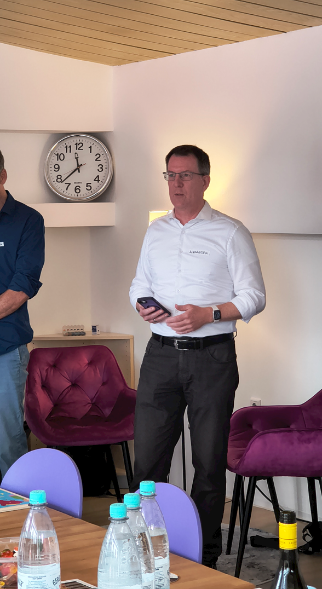
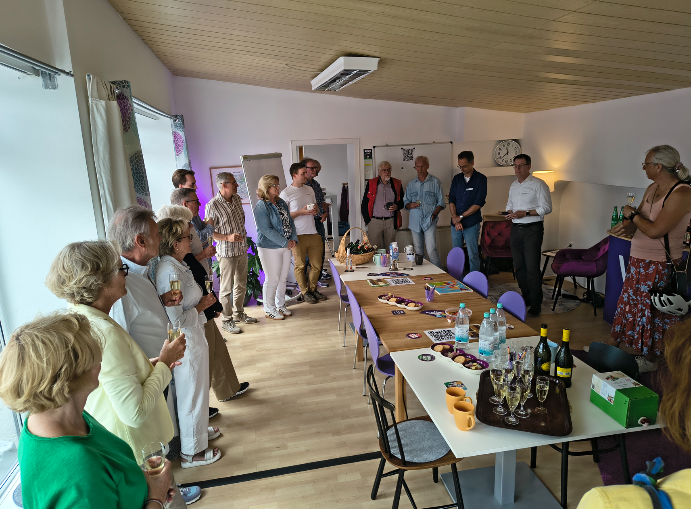
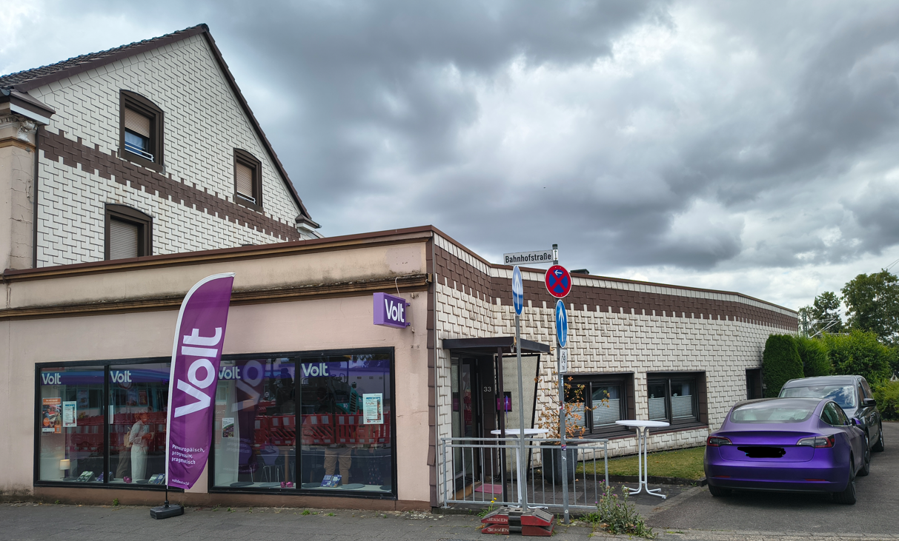
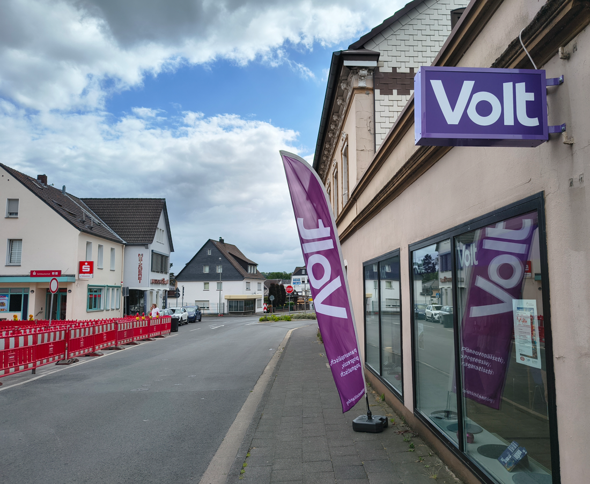
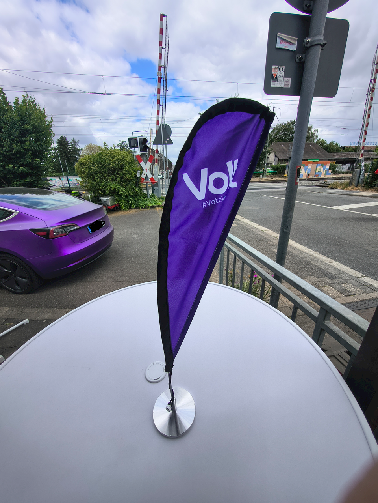

---

title: Einweihung des Volt Fraktionsbüros
date: 2026-07-20
summary: Die Volt-Fraktion Leichlingen feiert Eröffnung!
image: "../../assets/news/briefkasten.png"
tags: ["Volt", "Leichlingen", "Fraktion", "Bürger:Innensprechstunde", "Fraktionsbüro", "Bahnhofstraße 33"]
featured: true

---

Am Sonntag, dem 19. Juli, wurde das **Volt-Fraktionsbüro in der Bahnhofstraße 33** offiziell eröffnet. Unter den 25 Gästen waren, neben Freunden und Bekannten, vier Leichlinger Parteien vertreten, die sich unsere Räumlichkeiten mit Interesse angesehen haben und auf eine gute Zusammenarbeit mit uns anstoßen konnten.

Der Fraktionsvorsitzende **Alexander Dernbach** zog in seiner Begrüßung Parallelen zu der vor der Tür wild wachsenden, lila blühenden Distel und der kreativen und selbstbewussten Volt-Fraktion. Mit einem Schmunzeln bot sich eine willkommene Verbindung von Natur und Politik.

Bei bunten Getränken in den Farben rot, grün, schwarz, gelb, orange und natürlich lila gab es viele anregende Gespräche, die weiterhin eine gute Zusammenarbeit mit den demokratischen Fraktionen erwarten lassen. Interessierte BürgerInnen konnten sich vor Ort informieren, und alle sind herzlich eingeladen, bei weiteren Kennenlern-Terminen wie Meet&Greet mit der Fraktion im Gespräch zu bleiben. 

**Impressionen**:

